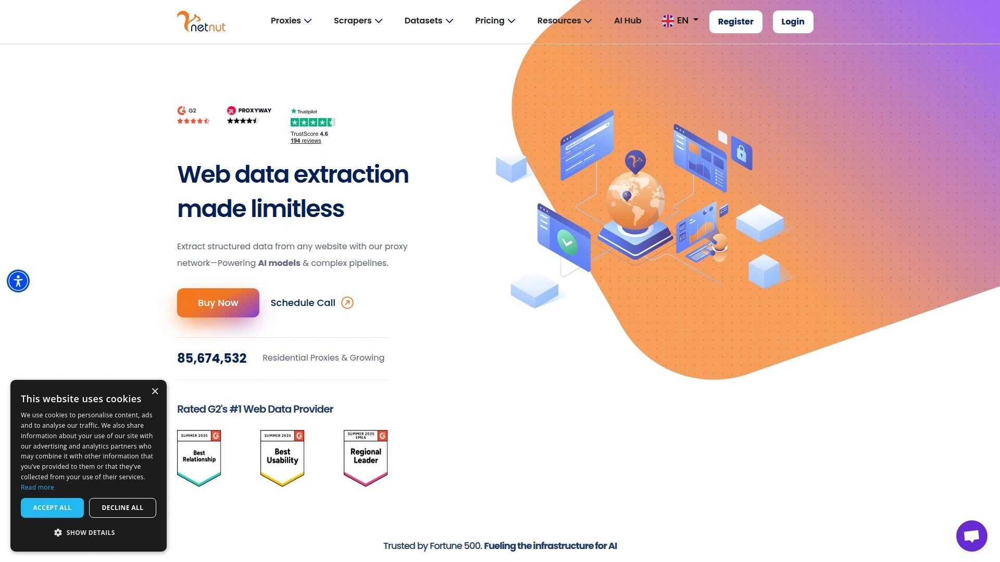

# Top 25 Web Scraping and Proxy Platforms Ranked in 2025 (Latest Compilation)

In today’s data-driven world, scraping websites without getting blocked can be a real headache. Constant CAPTCHAs, IP bans, and complex anti-bot walls are enough to frustrate any growth hacker or data engineer. Fortunately, a new generation of **web scraping platforms** and **proxy services** has emerged to tackle these pain points. These tools combine massive proxy networks, smart APIs, and automation to help you gather public web data at scale. The result? **Seamless access to information** with less worry about bans, higher success rates, and more controllable costs. Below, we’ve rounded up the **25 best solutions** – from proxy providers to all-in-one scraping APIs – to boost your data collection efficiency in 2025.

## **[Decodo](https://decodo.com)** – One-Stop Data Access Platform for Scraping at Scale

*Formerly Smartproxy, rebranded for an expanded mission in web data*. **Decodo** offers a huge proxy network (over 125 million residential, mobile, ISP & datacenter IPs) alongside advanced scraping tools. It blends **easy-to-use proxy management with an AI-powered scraper** (Site Unblocker and Web Scraping API) so you can fetch data without dealing with bans or headless browsers. Key highlights include:

- **Massive IP Pool & Global Coverage:** 125M+ IPs across 195 countries for unbeatable reach. You can target any region or city, with sticky sessions up to 24h for consistency.
- **Strong Performance, Great Value:** Delivers a rare balance of high success (≈99.9%) and reasonable pricing – it *stands out in its category* according to independent tests. You get reliable speed and a feature set that rivals premium providers, at a sensible cost per GB.
- **All-in-One Convenience:** Decodo isn’t just proxies; its **Web Scraping API** handles tough sites for you. This means even if a website throws CAPTCHAs or bot checks, Decodo’s backend solver and rotating IPs have you covered.
- **User-Friendly & Supportive:** The platform is very approachable for beginners – a clean dashboard, browser extensions, and plenty of guides. If you ever hit a snag, their 24/7 support (award-winning) is there to help. With a free trial and self-service sign-up, you can get started in minutes.

Overall, Decodo has evolved into a powerhouse that lets you *“effortlessly test, launch, and scale your web data projects”*. Whether you’re a solo entrepreneur or an enterprise dev team, Decodo’s combination of huge proxy pool and done-for-you scraping tools makes it a top choice for hassle-free data gathering.

## **[Bright Data](https://brightdata.com)** – Largest Proxy Network with Powerful Scraping Tools

**Bright Data** (formerly Luminati) is the heavyweight champion of proxy networks. It boasts **the world’s largest pool of IP addresses**, with over *150 million residential IPs in 195 countries*. If scale and variety are what you need, Bright Data delivers in spades – residential, datacenter, ISP, and mobile proxies, plus advanced web unlocking APIs.

This platform is trusted by Fortune 500 companies for a reason. Its proxies offer **industry-leading speed and success rates**, and you can target at country, city, or even ASN levels. Bright Data also provides a suite of **web scraping tools**: from a ready-to-use Web Unlocker that handles all blocks for you, to dataset services and no-code data collectors. Essentially, it’s an entire toolbox for web data: you can either rent the pipes (proxies) or use their high-level scraping APIs.

Do keep in mind, Bright Data comes at a premium price. The quality is top-notch (99.99% uptime, very low fail rates), but small users might find the cost relatively high. There’s a free trial for testing, and even a referral program, but this service truly shines for **large-scale projects** that demand reliability and are willing to invest. In short, Bright Data is the go-to for organizations that need **unmatched proxy breadth** and don’t mind paying for the best in class.

## **[Oxylabs](https://oxylabs.io)** – Enterprise-Grade Proxy Provider with AI Scraping Solutions

**Oxylabs** is a Lithuania-based provider known for its **premium proxy infrastructure** and focus on **enterprise solutions**. It runs one of the most robust networks, with *177M+ IPs worldwide*, encompassing residential, datacenter, ISP, and mobile proxies. Oxylabs stands out for its **exceptional performance** – in independent tests it consistently ranks at the top for success rates and low response times. If you need to gather massive amounts of data quickly (think market research, price monitoring, AI training data), Oxylabs is built to handle it.

Beyond raw proxies, Oxylabs offers **advanced scraping tools**. Their **Web Unblocker** is an AI-powered proxy solution that automatically avoids captchas and blocks, and they even launched an **AI Scraping Studio** to let you describe what data you need in plain English. It’s clear Oxylabs is innovating at the cutting edge of web data – integrating with ML workflows and providing *block-free scraping* out of the box.

Customers also get top-tier support, including dedicated account managers for business clients. Of course, all this is reflected in the pricing – Oxylabs is positioned as a premium service. They do have free trials for businesses and a 3-day money-back option for new users, which is great for evaluation. If you’re a **data-intensive operation or enterprise** that values quality, compliance, and support, Oxylabs is a trustworthy choice. It offers the **largest ethical pool and sophisticated tools to access web data at scale**.

## **[Zyte](https://zyte.com)** – Fully-Managed Web Scraping with Smart Proxy Management

**Zyte** (formerly Scrapinghub) takes a different approach: instead of just giving you proxies, Zyte can handle **the entire web scraping process** for you. It’s famous for tools like **Smart Proxy Manager (Crawlera)** and automatic data extractors. Zyte essentially says *“stop worrying – we’ll handle the hard parts”*. If juggling proxies, writing scrapers, and solving captchas is not how you want to spend your time, Zyte is made for you.

One of Zyte’s key offerings is its **Web Scraping API** with AI-powered crawling. You can point it at a website and it will navigate, extract the data, and return structured results without you writing complex spider code. For developers who do enjoy coding, Zyte provides **Scrapy Cloud**, a hosting platform for your spiders, and a rich ecosystem around the Scrapy framework. Essentially, they cater to both crowds: those who want a no-code/low-code solution and those who want infrastructure for their custom scrapers.

Zyte’s Smart Proxy Manager is also worth noting – it’s a proxy rotation service that seamlessly handles ban detection and retries. This means you can plug it into your scraper and drastically increase success rates with minimal effort. Many users love that Zyte *“makes the complex simple”*, freeing them from proxy headaches. Pricing is often per request or per site, which can be different from the volume-based GB pricing others use, but it often saves money by charging only for successful data. All in all, **Zyte is ideal for teams that want data without the grunt work** – it’s like having an expert partner that ensures your web scraping just works.

## **[Apify](https://apify.com)** – No-Code Web Scraping and Automation Platform

**Apify** is a versatile platform that enables you to **scrape websites or automate web tasks** without deep coding, thanks to its marketplace of ready-to-use scripts (they call them *Actors*). If you need to scrape a specific site, chances are someone has already built an Apify actor for it – whether it’s scraping Amazon products, real estate listings, or social media data. You can run these pre-built scrapers in the cloud with a few clicks. For more custom needs, you can also code your own in JavaScript or Python, and Apify will handle the execution, scheduling, proxy management, and storage.

One of Apify’s strengths is its **user-friendly interface** for setting up crawlers and the ability to chain workflows. For instance, you can scrape a list of articles, then use another actor to sentiment-analyze the content, all within Apify’s platform. It’s essentially a one-stop shop for web automation. They provide a generous free tier, and their pricing scales by usage (compute time, memory, etc.), which is nice if you just run small jobs occasionally.

Apify includes **proxy services** in the platform – you can opt to use Apify’s proxy pool (which includes residential IPs) so you don’t even need a separate proxy provider. This integration makes it convenient for users who want a **full scraping pipeline** in one place. Additionally, Apify’s community and support are very active; you can find a lot of help and documentation for tricky scraping scenarios. In summary, Apify is perfect for **those who want to get things done quickly** – whether you’re non-technical or a developer who wants a robust cloud scraper without managing infrastructure. Just pick or build a bot, and let Apify do the heavy lifting.

## **[SOAX](https://soax.com)** – Reliable Proxy Service with Clean IP Pools and Filters

**SOAX** is a proxy provider known for its **clean, quality-controlled IP pools** and granular filtering options. They offer **residential and mobile proxies** with a huge number of IPs (recently claiming over 100M+ across 195 countries). What sets SOAX apart is how much control you have: you can filter proxies by country, region, city, and even ISP, ensuring you use IPs that fit your exact needs. This is great for scenarios like localized SEO tracking or ad verification where you need a specific IP footprint.

The SOAX dashboard is often praised for being **user-friendly and intuitive**. Managing your proxy sessions (rotating vs sticky, etc.) is straightforward, and they provide helpful features like usage tracking and team account management. They also enforce strict quality checks on their IPs – unhealthy or slow proxies get weeded out regularly, so you’re left with a **“clean” pool that’s less likely to be flagged**. In fact, many users comment on the reliability and trust score of SOAX IPs compared to some bargain providers.

Performance-wise, SOAX proxies are fast and stable. They maintain a relatively smaller sub-pool active at any time to ensure high performance for all users. The success rates on scraping with SOAX are impressive, and their support is available 24/7 if you encounter any issues. On pricing, they sit somewhere in the middle: not the cheapest, but you’re paying for quality and support. If you value **high-trust IPs and precise targeting** over sheer volume, SOAX is a compelling choice. It’s especially popular among **mid-sized businesses and power users** who need reliable proxies for things like sneakers, social media automation, and web crawling with fine control.

## **[NetNut](https://netnut.io)** – Fast ISP Proxies and Rotating Residential Network

**NetNut** is a proxy provider that leverages a unique architecture – unlike most residential proxy networks that rely on end-user devices (P2P networks), NetNut routes traffic through **direct ISP connections** for many of its proxies. This yields some advantages in speed and stability. With a pool of over 52 million residential and ISP IPs (and growing), NetNut provides **rotating residential proxies** as well as **static ISP proxies** that are extremely fast. If your use case needs high request throughput and low latency (like real-time data gathering, sneaker drops, etc.), NetNut is designed for that.

One standout aspect is that **NetNut’s proxies don’t rely on live peers**, so the nodes are always available – no dependency on someone’s device being on. This gives a more consistent experience and often faster response times. They have servers worldwide and cover ~100+ countries with endpoint gateways for easy proxy list setup.

NetNut also offers an **API for proxy control**, and you can filter by country or city on their residential network. Their pricing is competitive for the performance you get; they often pitch themselves as a more affordable alternative to the very top-tier, while delivering comparable speeds. Another plus: NetNut provides a 7-day free trial for businesses and has a generous traffic rollover if you don’t use all your data in a month.

All in all, **NetNut is ideal for users who prioritize speed and consistency**. It’s heavily used in industries like e-commerce monitoring and stock market data scraping, where every second counts. The combination of a stable ISP backbone and rotating residential exit nodes means you get the **best of both worlds** – reliability and anonymity.

## **[IPRoyal](https://iproyal.com)** – Affordable Proxies with Unique Monetization Ecosystem

**IPRoyal** is a provider that’s made a name by being **budget-friendly and flexible**. They offer residential proxies, mobile proxies, datacenter, and even sneaker proxies, typically at prices lower than many competitors. One interesting aspect of IPRoyal is their **Pawns program** – a network where users can opt-in to share their internet (like a P2P proxy network) and earn money, which in turn feeds into the proxy pool for customers. This means when you use IPRoyal residential proxies, you’re often using IPs from real devices of people who have willingly joined (for compensation). It’s an ethically structured network and tends to have a wide global distribution of IPs.

Despite the lower cost, IPRoyal proxies perform decently well for most scraping and automation needs. The service supports **pay-as-you-go** plans, so you can buy small amounts of traffic without huge commitments – great for smaller projects. They also have **royal** plans for unlimited bandwidth on datacenter proxies which are popular for things like continuous tasks or VPN-like usage.

One trade-off of IPRoyal being a cheaper service is that it may not have all the bells and whistles of premium providers. For example, the pool size, while large, isn’t in the hundreds of millions; and very advanced targeting (ASN/Carrier targeting) might not be available on all plans. However, for most users who just need **reliable rotating proxies by country or city**, IPRoyal gets the job done.

Customer support is available but primarily during business hours. In summary, if you’re looking for **cost-effective proxies** for web scraping, social media, or testing, IPRoyal is a solid pick. It’s used by many as an entry-level or backup provider. Plus, knowing that the IP network comes from voluntary participants gives a bit of transparency in an often murky space.

## **[Infatica](https://infatica.io)** – Business-Oriented Proxy Network with Stable Performance

**Infatica** is a proxy service geared towards **business and enterprise users** who need quality proxies with less fuss. They provide residential proxies (around 35M+ IPs), mobile proxies, and datacenter proxies. Infatica’s angle is focusing on **network stability and professional support**. Their residential proxy pool might not be as massive as some top players, but they maintain it to ensure high success rates and reliable speeds.

One thing Infatica emphasizes is **ease of integration** – they have a straightforward API and documentation, so developers can get up and running quickly. You can authenticate by username/password or IP whitelist, and start rotating IPs on each request easily. They support country-level targeting (with city-level on higher plans) and have sticky sessions up to 30 minutes for when you need the same IP.

Infatica’s performance in independent tests has shown to be solid – good success rates and response times that are competitive. They may not market themselves loudly, but they quietly deliver where it counts. Pricing is mid-range; interestingly, they offer **commitment plans as well as revenue-share models** for resellers (skipping the details here). For a regular user, the plans start at a few hundred USD for a decent chunk of bandwidth, so it’s clear they’re targeting serious users rather than casual one-off scrapers.

If you’re a company or developer looking for a **reliable proxy partner** without the hype, Infatica is worth a look. The service feels **“business class”** – meaning it might not be the absolute cheapest, but you get a consistent, high-quality experience. The support team is quite responsive as well, which can be crucial if you hit any roadblocks during a critical project.

## **[PacketStream](https://packetstream.io)** – Peer-to-Peer Proxy Network for Budget Web Scraping

**PacketStream** stands out as a **community-powered proxy network**. It’s essentially a marketplace where individuals (“Packeters”) share their internet bandwidth, and users can route their scraping traffic through those residential IPs. This setup makes PacketStream one of the most **affordable** options for residential proxies: bandwidth costs around $1 per GB or even less, and you pay as you go.

For someone just starting or working on personal projects, that pricing is incredibly enticing – no steep minimums, just buy a few GBs and start scraping. The trade-off is that since it’s true peer-to-peer, the pool size and availability can fluctuate (people go on/offline). PacketStream currently has a network that spans many countries, but the density of IPs is lower than big providers. It works best for use cases that can tolerate a bit of variability and aren’t ultra time-sensitive.

Setting up PacketStream is very easy. After purchasing bandwidth, you get access to their **endpoint gateway**, which will automatically rotate through peers in whatever region you choose. One limitation: targeting specific cities or ASNs is not possible – it’s more of a basic rotating proxy service. Also, because it’s fully peer-sourced, sometimes IPs might be slower or not as “clean” (some may have been used heavily), though PacketStream actively tries to remove bad actors.

Despite those limitations, many users love PacketStream for **ad-hoc scraping tasks, data mining on a budget, or as a backup pool**. It also appeals to the privacy-conscious since it’s a decentralized model. If your project is small or experimental and you don’t want to spend much, PacketStream provides an easy on-ramp to using residential IPs. Just be mindful that with the lower price comes a bit of a *Wild West* element in terms of performance consistency.

## **[Storm Proxies](http://stormproxies.com)** – Simple Rotating Proxies for Small-Scale Scraping

**Storm Proxies** is a veteran in the proxy space that offers **no-frills, easy-to-use proxies** at a low cost. They became popular for their **rotating residential proxy** packages where you get access to a set of gateway IPs. For example, you can use an endpoint like `us.stormproxy.io:1000` and it will automatically rotate through a pool of US residential IPs on each request (or every 5 minutes if you prefer sticky). This setup is incredibly straightforward – you don’t have to manage a big list of proxies; Storm Proxies does the rotation on the back-end.

The **user experience is very plug-and-play**. There’s a dashboard but not too many bells and whistles. You choose how many ports (concurrent connections) you need and subscribe accordingly. Storm’s residential pool is relatively small (tens of thousands of IPs, not millions), and primarily US and EU based. Because of this, it’s best suited for **small-scale projects or specific niches** (like sneaker copping, basic web crawling, SEO monitoring) rather than enterprise-wide data mining.

One strength of Storm Proxies is consistency in what they offer: the IPs may recycle often, but the service is stable and the support, while email-based, is responsive. They even have **specialized proxies** for things like social media or classified ads that require local IPs. And if you need datacenter proxies or private dedicated proxies, they provide those too at competitive rates.

In summary, Storm Proxies is a **great entry-level choice**. It doesn’t match the scale of bigger players, but it also doesn’t come with complexity. The pricing is cheap (often flat monthly fees rather than per GB), making it attractive if you have a fixed scraping task and want unlimited bandwidth. Just point your bot at the proxy gateway and let Storm rotate IPs for you. For beginners or smaller operations, it’s a reliable and simple solution.

## **[Rayobyte](https://rayobyte.com)** – Transparent and Customizable Proxy Provider (Formerly BlazingSEO)

**Rayobyte** is a proxy provider known for its **transparent practices and customizable services**. They started in the datacenter proxy space as BlazingSEO and have since expanded to offer residential and ISP proxies under the Rayobyte brand. One big selling point: Rayobyte is committed to **ethical proxy sourcing** and openly talks about how they obtain their IPs (for example, via partnerships and consented networks, not shady methods). This transparency is reassuring for businesses that care about compliance and ethical use.

Rayobyte’s proxy offerings cover **millions of residential IPs** (they’ve cited numbers like 10M+ residential, plus large pools of datacenter IPs across many subnets). Their residential proxies allow country and city targeting and come with a full API for rotation control. They also offer **IPv6 proxies, dedicated ISP proxies**, and more – so if you have a very specific need (like a block of virgin IPs in a certain ASN, or high-bandwidth scraping), Rayobyte might accommodate it. In fact, they have a reseller program and even an API for reselling, highlighting how **flexible and developer-friendly** they are.

Another aspect is cost control. Rayobyte’s pricing for datacenter proxies is among the best (per IP or per thread), and for residential proxies they have options like **pay-per-GB or monthly bandwidth packages**. They often run promotions (e.g., first-month discounts) and have an affiliate system (no details here, just noting). If you plan to use a ton of proxies, Rayobyte can also negotiate custom deals. It’s the kind of provider where you can jump on a call and discuss your project – a bit old-school in customer service, in a good way.

To sum up, Rayobyte is **ideal for power users and businesses that want both performance and principles**. You get strong proxy performance, a wide range of products, and the ability to fine-tune your plan. Plus, their approach to doing business (clear terms, ethical sourcing) sets them apart in a field that sometimes has murky waters. For large-scale web data projects or reseller ambitions, Rayobyte is a top contender.

## **[Shifter](https://shifter.io)** – Unlimited Bandwidth Residential Proxies with Long Sessions

**Shifter** (formerly known as Microleaves) is a proxy provider that offers a bit of a unique proposition: many of its plans come with **unmetered bandwidth** on residential proxies. This means you pay a flat rate and can use as much data as you need, which can be a huge cost saver for data-intensive scraping. Shifter runs a **large peer-to-peer network** (over 31 million IPs) and is one of the oldest providers in the rotating residential proxy game.

The proxies from Shifter are **backconnect rotating proxies**. You get proxy endpoints that automatically rotate IPs from the pool. They have options for rotation every 5 minutes or 60 minutes (long sessions are useful if you don’t want your IP to change frequently while scraping). The service is pretty straightforward to use – just get your list of proxy gateway IPs after subscribing and plug them into your application. No complex config needed.

Shifter is especially popular in communities like sneaker bots and ticket scalping, where having *unlimited traffic* is a huge advantage because you might be sending a flood of requests in a short time window. It’s also used for general web scraping, though if your task is very large-scale, you’ll want to ensure the plan you choose has enough ports (concurrency) to handle it.

One thing to note: Shifter’s emphasis on unlimited usage means sometimes users might push the limits, which can affect proxy performance during peak times. There have been mixed reviews regarding speed or success rates under heavy load. However, they have been improving their infrastructure and also introduced **premium plans with fewer users per IP** for better reliability (at higher cost).

If your priority is **“all-you-can-eat” bandwidth and long-lived sessions**, Shifter is absolutely worth considering. It removes the worry of overage fees and lets you focus on extraction. Just make sure to size your plan (number of threads/ports) to match your needs for the best experience.

## **[Proxy-Cheap](https://proxy-cheap.com)** – Low-Cost Proxy Provider Living Up to Its Name

As the name suggests, **Proxy-Cheap** is all about offering proxies at **very affordable rates**. They provide residential proxies, mobile proxies, and datacenter proxies at prices that are often significantly lower than industry averages. This makes Proxy-Cheap a magnet for budget-conscious users or those who are experimenting and don’t want to invest heavily upfront.

Despite the low prices, Proxy-Cheap covers the basics quite well. Their residential proxy pool is decent in size (~7 million IPs reported historically, possibly more now) and spans all major regions. Setup is easy: you can generate proxy lists right from their dashboard, choosing your desired country or getting a random mix. They support sticky sessions and rotating sessions, similar to others. The performance is fair for the price – you might not get the ultra-high success rates of premium providers on very tough targets, but for general web scraping, social media, etc., it works out fine.

One thing to highlight is their **pricing flexibility**. Proxy-Cheap allows very small purchases (even 1 GB packages), and their per-GB cost can get exceptionally low if you buy larger plans. They frequently offer promo codes and volume discounts. It’s a great way to get started with residential proxies if you’re new, since you can test the waters with a couple of dollars. Plus, they have an API so you can integrate proxy management into your code if needed.

Of course, with great price comes some compromises. The documentation and support are not as extensive as higher-end services (though they do have support, it might not be 24/7 instant). And the pool might not be as polished – you could encounter a few more slow or dead IPs, though you can just rotate past them.

In summary, **Proxy-Cheap is perfect for users who need “good enough” proxies at the lowest possible cost**. It lowers the barrier to entry for web scraping projects. Students, indie developers, or anyone running large volume scrapes on a shoestring budget will find Proxy-Cheap extremely valuable. Just manage your expectations accordingly, and you’ll likely be pleasantly surprised at what you get for the money.

## **[ProxyEmpire](https://proxyempire.io)** – Premium Rotating Proxies with Global Coverage and Integrations

**ProxyEmpire** is a newer proxy provider that focuses on **quality over sheer quantity**. They offer rotating residential proxies (and mobile proxies) with a pool of around 5 million IPs that’s carefully curated. One of ProxyEmpire’s selling points is its **global coverage** – IPs in **170+ countries** – which is great if you have diverse geo-targeting needs. They also emphasize working smoothly with various third-party tools; for example, they provide guides for integrating with things like web scraping frameworks or anti-detect browsers.

In terms of usage, ProxyEmpire gives you a lot of control. You can generate sessions that rotate on each request or stick for up to 30 minutes. They also allow filtering proxies by country or even by state/region for some locations. The network has shown very solid success rates on challenging websites, likely because they keep their pool fresh and don’t overload their IPs with too many users.

Another aspect is their **focus on customer experience**. The dashboard is sleek and provides useful stats (like success ratio, bandwidth used, etc.). They also have responsive support that’s open to helping with specific scraping challenges. If you need a proxy solution and aren’t sure how to optimize it, ProxyEmpire’s team is known to give useful advice – that’s a nice touch for newcomers.

Pricing for ProxyEmpire is on the premium side (comparable to services like Soax or Smartproxy). They charge per GB, and the packages scale up in volume. They might not be the cheapest, but the consistency and support justify it for many. They also offer a **7-day money-back guarantee** which is somewhat rare in this space, reflecting confidence in their service.

In short, **ProxyEmpire is a great choice for those who want a balanced, ready-to-go proxy solution**. It may not have 100M IPs, but the IPs it does have perform excellently. It’s like opting for a curated experience over a mass-market one. For agencies, marketers, or developers who value *reliability, support, and easy integration*, ProxyEmpire is a provider to consider in 2025.

## **[ProxyRack](https://www.proxyrack.com)** – Diverse Proxy Pool and Plans for Every Need

**ProxyRack** is a long-standing proxy provider that offers a **wide variety of proxy services** – from residential and datacenter proxies to special endpoints for things like Craigslist or other classified sites. One interesting thing about ProxyRack is that they have different types of plans: **Bandwidth-based plans, thread-based plans, and even a unique “unmetered” residential plan** where they cap threads instead of data. This means whether you prefer to pay for data or for concurrent connections, they likely have an option that suits you.

The residential proxy pool of ProxyRack is quite extensive (over 2 million IPs online at any given time, with tens of millions in rotation). They provide both **rotating residential proxies** and **sticky endpoint proxies** (where an IP stays the same for up to 30 minutes). They also have **GeoProxies** which allow choosing specific countries or regions. One standout feature is their **unmetered residential proxy service** – you pay a fixed price and can use unlimited data with a certain number of threads. This is fairly rare (Shifter does similar), and it’s appealing if you want cost predictability for heavy usage.

ProxyRack’s performance is solid for most use cases. It might not be the absolute fastest or highest success on extremely protected sites (those tasks are better suited to a combination of specialized APIs and proxies), but for general web data gathering, it holds up well. Many users appreciate it for tasks like web scraping, account creation, and ad verification.

Setting up is straightforward, though the plethora of plan options means you should plan what you need ahead of time. The documentation is clear, and they even run a **peer-sharing program** of their own (similar to IPRoyal’s Pawns), which supplies some of their network – showing they too blend P2P in their model.

In essence, **ProxyRack is about flexibility and value**. It’s like the Swiss army knife of proxy providers: however you want to use proxies, they have a way to package it for you. If you’re someone who likes to tinker with different approaches or you run varied projects (some small, some large), ProxyRack can be very cost-effective. Plus, they’ve been around for years, which adds to their credibility as a reliable player in the proxy market.

## **[NodeMaven](https://nodemaven.com)** – Next-Gen Proxies Built for Multi-Account and Automation Pros

**NodeMaven** is a rising star in the proxy world, designed with **“digital hustlers” and automation experts in mind**. It has quickly gained traction among affiliate marketers, social media managers, and others who run many accounts or bots simultaneously. The reason? NodeMaven focuses on delivering **undetectable, high-quality residential & mobile proxies** tailored for these scenarios.

A key differentiator for NodeMaven is its **Smart IP Quality Filter**. Essentially, they pre-scan and filter out any low-quality or flagged IPs from their pool, so you’re less likely to hit bad proxies that could trigger anti-bot systems. This means the IPs you get are clean and have a good reputation score, which is gold when you’re, say, managing multiple social media accounts or doing ad verification. Moreover, all their residential and mobile IPs are priced the same, which gives you flexibility to switch between them without cost concerns (mobile IPs often have higher trust).

The network size is in the millions (not as gigantic as Bright Data, but enough to maintain anonymity across various platforms). NodeMaven allows **24-hour sticky sessions**, which is excellent for account management use cases – you can keep the same IP for a whole day if needed. They also offer **pay-as-you-go** pricing with automatic volume discounts and even **traffic rollover** (unused bandwidth carries over) – very user-friendly policies.

From a performance perspective, NodeMaven has been validated by independent testers like IP quality scores (Pixelscan) showing it’s truly hard to detect. They also ensure high concurrency and have an onboarding wizard that helps you configure proxies specifically for tools like Dolphin Anty, Multilogin, etc., which shows how focused they are on that niche.

In summary, **NodeMaven is the proxy service for power users who demand stealth**. If you’re running automation for growth hacking, farming, or managing dozens of accounts, this service was literally built for you. It stays stable, **passes Cloudflare/Akamai checks smoothly**, and offers the flexibility and pricing model that advanced users appreciate. Keep an eye on NodeMaven – it’s part of the new wave of proxy providers bringing fresh ideas to the industry.

## **[ResiProx](https://resiprox.com)** – High-Success Residential Proxies with Fine-Grained Targeting

**ResiProx** is a provider that brands itself as *“your gateway to the world”*, and for good reason. They maintain a **large residential proxy pool (tens of millions of IPs)** with coverage in over 180 countries, and they put a special emphasis on **success rate and speed**. In fact, ResiProx advertises a remarkable ~99.9% success rate and sub-second response times, which signals how much they optimize their network for performance.

One of ResiProx’s big pluses is the **level of targeting it offers**. You can target by country, of course, but also drill down to state/region, city, and even ZIP code or ASN in many cases. This is extremely useful if you need highly localized data or want each proxy to appear from a very specific locale. Combined with the high success rates, it makes ResiProx a favorite for use cases like local SEO monitoring, precise ad verification, or any scenario where **every request counts** and you can’t afford failures.

ResiProx provides an easy dashboard and API. You can create proxy endpoints on the fly for whatever targeting you need, and choose rotation behavior (each request vs. time-based sticky sessions). They also offer **24/7 customer support**, which for a relatively new provider shows they are serious about courting enterprise clients as well as individual users.

In terms of pricing, ResiProx is in the mid-to-premium range, reflecting the high quality. It might not be the go-to for a hobby project on a tight budget, but for professional projects where **efficiency and reliability justify the cost**, it delivers value. Some plans come with unlimited threads and you simply pay per GB, which is straightforward.

To wrap it up, **ResiProx is all about high performance and precision**. It’s the kind of service you choose when you have a challenging scraping job and you absolutely need it done right – perhaps you’re scraping ticketing websites with heavy anti-bot or doing compliance monitoring that requires near 100% data retrieval. ResiProx steps up to those challenges with a robust offering that is quickly earning it a good reputation.

## **[Massive](https://joinmassive.com)** – Ethically-Sourced Proxy Network Emphasizing Speed and Success

**Massive** is a newer provider in the residential proxy scene, notable for its **ethically-sourced network** and impressive performance stats. They source their IPs via an SDK (users opt-in through partnered apps), ensuring transparency and compliance in how the proxy pool is built. This model is similar to others like Honeygain, but Massive seems to focus on keeping a **smaller, high-quality pool** rather than boasting sheer numbers. For example, their active pool might be around 1.5–2 million residential IPs at a time – not the largest, but each IP is rigorously checked.

Where Massive really shines is **success rates and stability**. In third-party testing, Massive’s residential proxies had success rates upwards of 99.8% – basically on par with the top premium providers. This is likely because by controlling their network more tightly, they avoid overloaded or bad IPs. They also allow you to select specific **IP types like TV IPs** (perhaps for certain streaming or locale-specific needs) which is a unique niche feature.

Massive’s service includes the usual goodies: global location support (195+ countries), sticky sessions, and an API. The IP rotation can be very quick, making it suitable for scraping tasks that require frequent identity change. Also, because their network is ethically sourced, you reduce the risk of sudden IP disappearances – the hosts are participating consistently.

On the pricing front, Massive is not “cheap” in the absolute sense, but it’s competitive for the quality it offers. They pitch themselves against the Oxylabs and Bright Data of the world, claiming similar performance at a more accessible price point. They also support a referral program (and possibly a waitlist for affiliates earlier on), though in the main product offering, they highlight *straightforward plans without hidden fees*.

In summary, **Massive is a great choice if you prioritize ethical sourcing and high performance**. It’s kind of in the name – aiming to be a “massive” solution in terms of impact, not necessarily IP count. For businesses and developers who want a clean conscience and excellent results, Massive provides a refreshing option in the proxy market.

## **[DataImpulse](https://dataimpulse.com)** – Custom-Tailored Proxy Solutions at Budget Prices

**DataImpulse** is a proxy provider that caught a lot of attention for its **aggressive pricing** and custom approach. They offer residential proxies at rates as low as **$1 per GB**, which is extremely competitive. This low entry price makes DataImpulse an attractive option for those who need to run large scraping jobs without burning through cash. However, DataImpulse’s model often includes à la carte features – for instance, basic service might cover standard country-level proxies, but if you need extras like city targeting or dedicated channels, those might come as add-ons (still reasonably priced, but something to be aware of).

The proxy network DataImpulse provides is sizable (tens of millions of IPs) and spans many countries. Performance-wise, it delivers solid results for the cost. You might experience slightly lower success rates or speeds on very strict targets compared to pricier providers, but many users find it to be a **“sweet spot” between cost and functionality**. If you configure things properly, you can achieve high success on most websites while taking advantage of that $1/GB base price.

DataImpulse also prides itself on a **personalized service** for business clients. They can develop custom proxy solutions or integrate with your infrastructure if needed. This is a bit different from the one-size-fits-all dashboards of others – DataImpulse is willing to be flexible, which is great if you have unique requirements. For example, if you needed a certain number of IPs in a less common country or a non-standard rotation policy, they might work with you on that.

One thing to note is the importance of reading the fine print – as mentioned, the base price is great, but check if things like geo-targeting in specific regions incur a small additional fee. Even with add-ons, it often remains a great deal, just not as jaw-droppingly low as the headline might suggest once you fully kit it out.

All in all, **DataImpulse appeals to the savvy user who wants customization and low cost**. It’s especially useful for large-volume scrapers like SEO firms or price aggregators that need to minimize bandwidth costs. You get a capable proxy service and can save money, as long as you tailor the service to your needs and understand which features you require. It’s like the budget car that, with a few upgrades, can run like the expensive models – and still cost you less in the end.

## **[Evomi](https://evomi.com)** – Ultra-Affordable Proxies with Ethical Sourcing and Free Trial

**Evomi** has rapidly positioned itself as *the* choice for **budget residential proxies** without sacrificing core quality. The headline here is eye-popping: **residential proxies starting at $0.49 per GB** – yes, under fifty cents! By our research, that’s about the cheapest rate in the market from a legit provider. For that alone, Evomi is grabbing attention, but it’s not just the price. They’re based in Switzerland and emphasize a **“Swiss-grade” commitment to quality and ethical operations**.

Evomi’s network includes residential, mobile, and datacenter proxies. They source their IPs ethically (similar to Massive, via user-consented means) and thus can ensure a respectable level of reliability despite the rock-bottom cost. They openly highlight their **ethical principles and transparency**, which is reassuring for users who worry about where IPs come from. Additionally, they are keen on customer satisfaction – evidenced by the fact that Evomi offers a **completely free trial** for residential proxies. That means you can test their service thoroughly without paying a dime, which is rare and shows confidence in their product.

In terms of performance, Evomi proxies perform admirably for most tasks. They may not beat a premium provider in edge cases, but users report that for web scraping, automation, and general use, Evomi holds its own. They have decent global coverage (with especially strong presence in Europe due to their roots). Also, their support is noted to be responsive – they may be budget, but they don’t leave you stranded if you need help.

It’s also worth noting Evomi’s other offerings: they have **datacenter proxies at $0.30/GB, mobile proxies at $2.2/GB, and static ISP proxies from $1/IP**, all quite affordable in their categories. So whether your need is rotating residential IPs or just some static proxies for account management, Evomi likely has one of the best deals out there.

The bottom line: **Evomi is redefining the budget tier**. It’s perfect for students, hobbyists, or startups, as well as larger outfits that need to scale up without breaking the bank. With that free trial and ultra-low pricing, it’s practically a no-lose proposition to give them a try. Many will find that *“cheap” doesn’t mean “bad”* in Evomi’s case – you get reliable, ethically-sourced proxies and keep your wallet happy too.

## **[ScrapingBee](https://scrapingbee.com)** – Web Scraping API that Handles Browsers and Proxies for You

Moving beyond just proxies, **ScrapingBee** is a **web scraping API service** aimed at developers who want to fetch web data without dealing with the usual headaches. With ScrapingBee, you don’t worry about proxies, headless browsers, or CAPTCHAs – the API takes care of all that under the hood. You simply make a request to ScrapingBee’s endpoint with the URL you want to scrape (and any options), and it returns the HTML or JSON data you need. It’s like outsourcing the entire “getting the page” part of scraping, so you can focus on parsing the data.

One of the killer features is that **ScrapingBee can render JavaScript**. If a website is client-side heavy (requiring a headless browser to fully load content), ScrapingBee handles that by spinning up headless Chrome instances as needed. It also rotates proxies for you and can solve basic CAPTCHAs. Essentially, it wraps a browser, proxy management, and anti-bot tactics all into a simple API call. As their site succinctly puts it, *“ScrapingBee API handles headless browsers and rotates proxies for you.”*

For example, if you want to scrape an Amazon product page (which is notoriously tricky), instead of juggling a proxy pool and custom headers, you can just call ScrapingBee’s Amazon API with the product URL and you’ll get parsed data or raw HTML as you prefer. They have similar specialized APIs for Google Search, Walmart, etc.

ScrapingBee offers a **free tier** (1,000 API calls free) to try out, and then paid plans starting at $29/month for 50k requests. The pricing is request-based rather than bandwidth-based, which for many scenarios is easier to predict. If your pages aren’t huge, this can be very cost-effective compared to hiring proxies and maintaining infrastructure. And if your pages are huge, well, you’re paying for the convenience of not dealing with them manually.

In short, **ScrapingBee is fantastic for developers or teams who say “I just want the data, I don’t want to babysit scrapers.”** It abstracts away the tough parts of scraping. The only caveat is if you have extremely specific needs for how requests are handled, a custom-built solution with your own proxies might give more control. But for the majority of cases, ScrapingBee strikes a wonderful balance: you get the benefits of a full scraping setup (proxies + headless browser) with just a simple API. It’s trusted by many businesses for scaling their data collection without the usual pains.

## **[ScraperAPI](https://scraperapi.com)** – Scalable and Developer-Friendly Proxy API for Web Scraping

**ScraperAPI** is another popular web scraping service that provides an **API to retrieve web pages with built-in proxy rotation and anti-bot measures**. The concept is similar to ScrapingBee: you make a request to ScraperAPI with a target URL, and it returns the result after handling all the dirty work (IP proxies, geolocation, CAPTCHAs, etc.). This service has been around for a while and has a strong reputation among solo developers and startups because of its ease of use and generous offerings.

One of ScraperAPI’s big draws is **unlimited concurrency**. You can literally fire as many requests in parallel as you want, and their infrastructure will handle it (some services limit you by QPS or threads, but not ScraperAPI). This makes it incredibly powerful if you need to scrape a large number of pages quickly. They manage a proxy pool of over 40 million IPs, covering both datacenter and residential IPs, automatically switching as needed to get a successful response.

ScraperAPI also automatically handles **CAPTCHAs and retries**. If a site blocks you or presents a challenge, ScraperAPI will detect it and retry with different tactics, without you having to code any fallbacks. You can specify parameters like country code if you need a specific region, or whether or not to render JavaScript (they have an optional headless browser mode for dynamic pages). For most common scraping tasks, it’s basically plug-and-play.

In terms of pricing, ScraperAPI is quite developer-friendly. They have a free plan (up to 1,000 requests/month) for testing, and paid plans that are very scalable – for instance, $49/month for 250k requests, $99 for 1 million requests, etc. If you do the math, it often comes out cheaper than assembling your own proxy + headless solution, especially when you factor in time saved. They also advertise **50% recurring commissions for affiliates**, reflecting how confident they are in long-term satisfaction (but that’s behind the scenes; the user benefit is the solid service).

Overall, **ScraperAPI is beloved by many in the scraping community** because it just works and lets you focus on data extraction logic rather than networking. It’s used for everything from pricing comparison, real estate data aggregation, to academics scraping research data. If you want to supercharge your web scraping without maintaining a proxy fleet, ScraperAPI is a tried-and-true choice that can scale with your needs.

## **[ScrapingAnt](https://scrapingant.com)** – Affordable Headless API for Web Scraping with Generous Free Tier

**ScrapingAnt** is a web scraping API service that offers a simple way to fetch web pages, similar to ScrapingBee and ScraperAPI, but often at a more **budget-friendly price point**. It handles the heavy lifting of web scraping: rotating proxies, managing headless browsers, and bypassing anti-scraping measures. ScrapingAnt positions itself as one of the **most affordable scraping API solutions**, which makes it attractive for smaller projects or startups.

One great thing about ScrapingAnt is its **generous free plan** – they usually offer around 10,000 API calls for free each month, which is a lot more than many competitors. This means you can potentially run a small-scale scraping operation entirely free, or at least thoroughly test the service before paying a cent. When you move to paid plans, the pricing remains competitive and is often usage-based per request.

In terms of capabilities, ScrapingAnt supports **JavaScript rendering** (so it can handle SPAs and dynamic content) and provides options to use residential proxies for tougher targets. You can specify the geolocation of the proxy if needed, and it will attempt to fetch the page accordingly. If a site is known to be particularly challenging, ScrapingAnt has specialized handling and even allows you to inject custom headers or cookies through the API if you need that level of control.

While ScrapingAnt might not yet be as widely known as some older services, it’s building a solid rep for **reliability and developer support**. They have clear documentation and even publish a blog with scraping tips, showing their engagement with the community. The service integrates easily into any stack (just make HTTP requests to their API and get data back), so language is not a barrier.

To summarize, **ScrapingAnt is like a hidden gem for cost-effective web scraping**. It gives you the power of headless Chrome and proxy rotation without you managing any infrastructure, and it does so at a lower cost threshold. If you are on a tight budget or just love a good deal, ScrapingAnt allows you to *“get data like the big guys”* without spending big money. It’s particularly suitable for developers who need an API to scrape sites on-demand and want to keep it simple and cheap.

## **[WebScrapingAPI](https://webscrapingapi.com)** – Robust All-in-One Scraping Solution with Anti-Bot Bypass

Despite its very generic name, **WebScrapingAPI** is a distinct service – a fully-fledged scraping API designed to tackle even the most fortified websites. It provides a one-stop API endpoint where you feed in a URL (and any desired parameters like location or device profile), and it returns the raw HTML or extracted data. Behind the scenes, WebScrapingAPI employs a mix of **headless browser technology, AI-based anti-bot detection avoidance, and a large proxy network** to ensure you get the data you asked for.

The service is built to handle things like Cloudflare IUAM (the “challenge pages”), various kinds of JavaScript-heavy sites, and rotating IP blocks automatically. For example, if you try to scrape a site like LinkedIn or Nike that has strong protections, WebScrapingAPI’s engine will continuously adjust (change IPs, switch user agents, solve captchas if needed) until it successfully fetches the page or exhausts its strategies. This is extremely valuable – it means you can throw hard targets at it and have a high chance of success without pulling your hair out.

WebScrapingAPI also supports **custom scripts** if you need to do more than just get HTML. For instance, you could instruct it to click a button or scroll, etc., though for most needs you just want the HTML and they handle the basics. They have specific API endpoints optimized for common tasks, such as scraping search engine results or e-commerce sites, making it easier if those are your use cases.

On the pricing front, WebScrapingAPI typically offers monthly subscription tiers based on the number of requests and concurrency. They also boast features like **30% recurring commissions for referrals** (which indicates they cater to partners too, but that’s tangential for end users). The cost per request is on par with similar services – not the cheapest, but considering the firepower it brings, it’s reasonable for businesses that absolutely need the data. Plus, they offer some free credits or trial period, so you can test it on your target sites.

In conclusion, **WebScrapingAPI is a powerful ally when you’re dealing with complex web scraping jobs**. It’s especially useful for those “problem” websites where ordinary scraping fails. Instead of giving up or investing weeks in building your own scraper that might break soon, you can offload that to WebScrapingAPI and get consistent results. It’s like having a specialized scraping task force on call – you send a request, and they deliver the goods, shields and defenses be damned.

---  

**FAQ:**

**Q1: How do these platforms handle CAPTCHAs and anti-bot challenges?**
**A1:** Most of the listed services have built-in measures for CAPTCHAs and bot protection. For example, scraping APIs like **ScrapingBee** and **WebScrapingAPI** will automatically solve or bypass CAPTCHAs for you. Proxy providers like **Decodo** and **Oxylabs** offer special endpoints (e.g., Decodo’s Site Unblocker) that intelligently route requests to avoid triggering anti-bot systems. In practice, this means you won’t have to constantly change settings – the platforms adapt behind the scenes to keep your requests successful.

**Q2: How should I choose between using a proxy network vs. a scraping API service?**
**A2:** It depends on your project’s needs and your technical comfort. If you **already have a scraping tool or script** and just need reliable IP rotation, a proxy provider (like **Decodo** or **Soax**) is ideal – it gives you the raw network power and you control the crawling logic. On the other hand, if you **want an all-in-one solution** where you simply ask for a URL’s data and get it, then a scraping API (like **ScraperAPI** or **ScrapingAnt**) is great. Scraping APIs manage proxies, headless browsers, and blocking for you, which speeds up development. However, they can be more costly per request. For ultimate flexibility and lower cost at scale, seasoned developers might use a proxy service + custom scraper; for quick results and ease, go with an API.

**Q3: Do these providers offer free trials or plans?**
**A3:** Yes, many do. **Decodo** has a free trial option (and a 14-day money-back guarantee for paid plans). **Evomi** notably offers a completely free trial for their proxies. **ScrapingBee** gives 1,000 free API calls, **ScraperAPI** has 1,000 free requests, and **ScrapingAnt** offers about 10k free requests monthly. Proxy providers like **Bright Data** and **Oxylabs** often require a credit card but have trial credits or refund periods for testing. It’s always a good idea to take advantage of these trials to ensure the service meets your expectations before committing.

---

In conclusion, the **web scraping and proxy landscape in 2025** offers a rich selection of tools for every need and budget. From hands-on proxy platforms that let you micromanage IP rotation, to hands-off scraping APIs that deliver data with minimal coding – the options are endless. The right choice comes down to your specific scenario: a solo developer might love the simplicity of an API service, while a data engineering team might prefer the control of a proxy network. The good news is that all the platforms listed here are proven to help overcome scraping hurdles like IP bans, geo-restrictions, and dynamic content.

If you’re still unsure where to start, we highly recommend **trying our #1 pick, [Decodo](https://decodo.com)**. It earned the top spot for its all-around strengths – an enormous proxy pool, built-in scraping solutions, and user-friendly interface – making it suitable for almost any web data project. With **Decodo** in your toolkit, you can stop worrying about IP blocks and focus on extracting the insights you need, efficiently and reliably. Here’s to successful scraping and unlocking the full potential of public web data!
